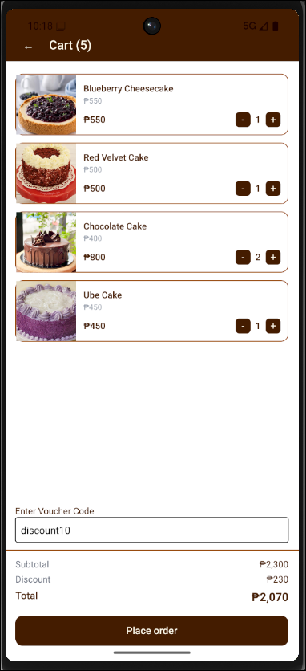

# AddToCart



Hello! This is a simple Add to Cart app built using React Native and Expo.

## Features

- Add items to cart
- Remove items from cart
- Apply voucher code: discount10 for 10% discount

## Limitations

- No order submission / checkout functionality

## Tech Stack

- React Native
- Expo
- Tailwind CSS

## How to Run

```bash
npm install
npx expo start
```

### Image Sources

- https://tedboycnd-cdhwdbg6ard6f4cp.z01.azurefd.net/images/thumbs/0010980_awfully-chocolate-cake-whole_625.png
- https://www.pinoycookingrecipes.com/uploads/7/6/7/8/7678114/published/img-1612966359581-1.png?1612995697
- https://www.mybakingaddiction.com/wp-content/uploads/2022/08/close-up-blueberry-topped-cheesecake-700x1050.jpg
- https://images.yummy.ph/yummy/uploads/2011/10/UbeMacapunoCae-1.jpg
